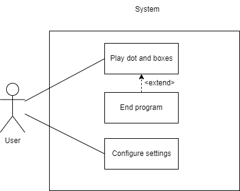
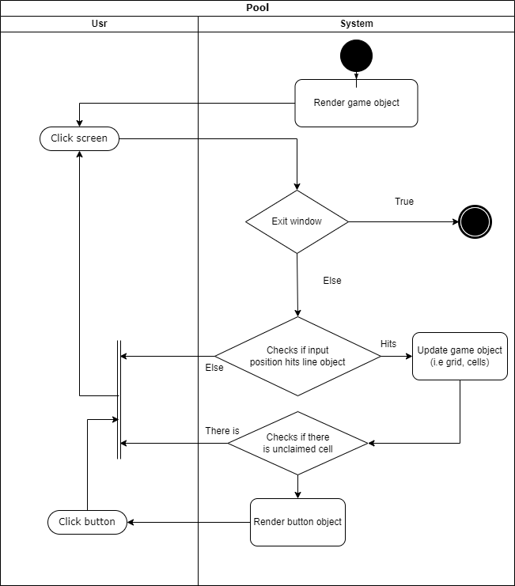
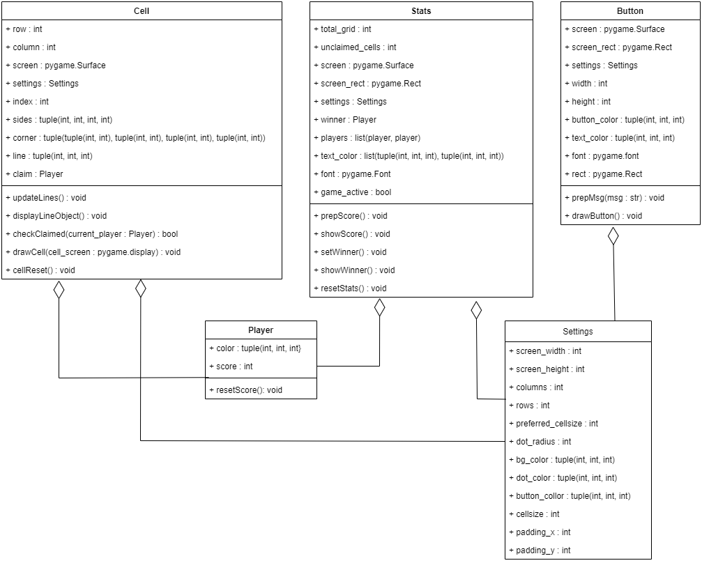
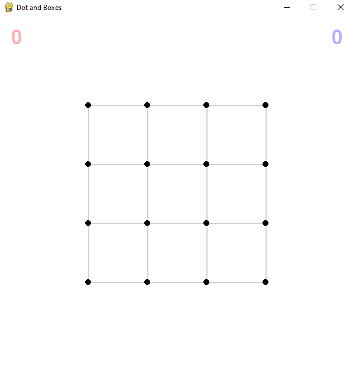
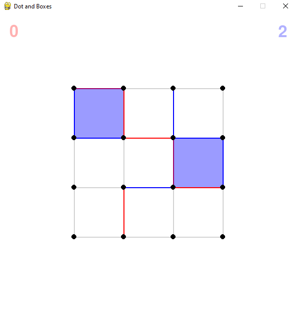
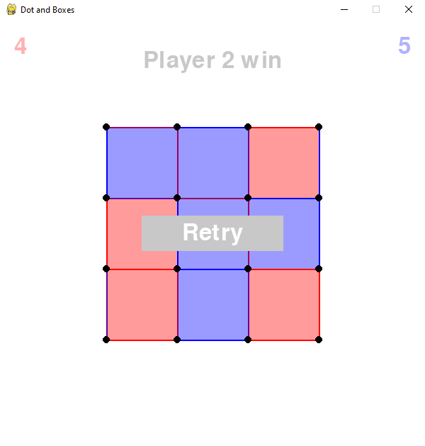

# Dot and Boxes documentation
The code is my implementation of the classic game of dot and boxes where each player taking turn to create a line on the given grid and get a point for each box created. You can run the code by running dot-and-boxes.py file as the main file. Once you run the file a window will appear, and it will display a grid. To play the game simply create a box by creating a line on the grid where each player will take turn. The game ends once the grid is fully claimed and it will display the winner and play button. If you want to stop playing the game, you can press the ‘X’ button on the window

## Use Case Diagram

## Activity Diagram

## Class Diagram

## Module
- Pygame

Pygame is essential when you are trying to create a game in python. Pygame also helps create the GUI for the game.

- Sys

Sys is one of Built-in module that python creates. This module enables the program to stop by calling the function exit(), this function is useful especially when you use a seperate file for the main program and the script (i.e game_function.py in this case)

## Screenshots
### Start of the program

### Midgame

### Endgame

## Reflection
I do learn a lot during the making of the project. The main thing I learn for sure is the pygame module itself and utilizing the rect object, screen, and more. Secondly, I learn on how object works and how to use it in a proper way. Lastly, I also learn how to structure your code even though I feel I still lacking a bit at this , I do still learn quite a bit about code structuring.